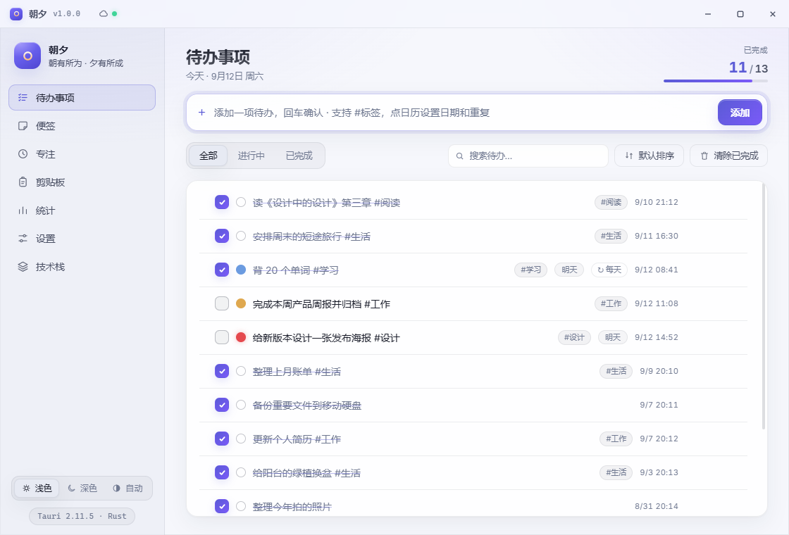

<div align="center">


# 朝夕

**朝有所为 · 夕有所成** —— 本地优先的 Windows 效率工作台

Tauri 2 · Rust · TypeScript · 原生 DOM · 零前端框架


</div>



## 功能特性

- **待办**：标签、优先级、截止日与重复规则、拖拽排序、行内编辑、删除撤销
- **便签 / 专注（番茄钟 + 统计）/ 剪贴板历史 / 统计** 四大实用板块
- **账号与云同步**：邮箱注册（验证码）登录；多设备增量同步（LWW + 墓碑）；切换账号本地数据自动归档
- **系统集成**：系统托盘、开机自启、全局快捷键、窗口置顶、跟随系统深浅色
- **Apple 风格**：弹簧动效、毛玻璃、双主题、自绘月历
- **本地优先**：数据始终保存在本机 `%APPDATA%\com.simple.todo\`，云端仅用于多设备中转，可完全离线使用
- **轻量**：Tauri 2 + 系统 WebView2，不捆绑 Chromium/Node，主程序约 5 MB

## 下载

从 [Releases](https://github.com/btrencai/zhaoxi/releases) 下载：

| 文件 | 说明 |
|---|---|
| `zhaoxi-v1.0.0-portable.exe` | 便携版（单文件绿色版，双击即用） |
| `zhaoxi-v1.0.0-setup.exe` | NSIS 安装版（开始菜单 + 卸载） |

> 未做代码签名，首次运行如遇 SmartScreen 提示请选择"仍要运行"。

## 开发

```bash
npm install
npm run tauri dev        # 开发模式（热重载）
npm run tauri build      # 本地构建 exe（产物在 src-tauri/target/release/）
```

构建时可通过环境变量注入内置服务器地址（不出现在界面中）：

```bash
CLOUD_SERVER="https://你的服务器" npm run tauri build
```

## 自动构建与发布

| 流水线 | 触发条件 | 产物 |
|---|---|---|
| `Build Windows App` | 推送 `v*` 标签 / 手动触发 | exe + 安装包；**打标签时自动创建 GitHub Release 并附上两个文件** |
| `Publish Server Image` | 推送 main / `v*` 标签 / 手动触发 | 容器镜像 `ghcr.io/btrencai/zhaoxi-cloud` |

### 发一个新版本（全自动出 Release）

```bash
# 1) 改版本号（package.json / src-tauri/tauri.conf.json / src-tauri/Cargo.toml）
# 2) 提交后打标签并推送：
git tag v1.0.1 && git push origin v1.0.1
```

推送标签后会自动完成：构建 exe → 构建安装包 → 创建 Release（自动生成更新说明）→ 附上两个文件。

> 也可以在 GitHub 网页端「Releases → Draft a new release」直接新建标签发布，同样会触发构建并自动补齐文件。

如需重跑某个版本的构建（比如构建失败后修复重试）：

```bash
git tag -d v1.0.1 && git push origin :refs/tags/v1.0.1   # 删除旧标签
git tag v1.0.1 && git push origin v1.0.1                 # 重新打标签推送
```

## 服务端（云同步）

`tools/cloud-server.py` —— 单文件 Python（纯标准库 + SQLite），提供注册（邮箱验证码）/ 登录 / 增量同步 / 登出接口。

### 容器部署（GHCR 镜像）

```bash
docker run -d --name zhaoxi-cloud -p 8787:8787 \
  -v zhaoxi-data:/data \
  ghcr.io/btrencai/zhaoxi-cloud:latest
```

- SQLite 数据库写入 `/data/zhaoxi-cloud.db`
- 需要邮件验证码时，把配置文件挂载到 `/data/cloud-config.json`（SMTP 等，参见 `deploy/cloud-config.example.json`）
- 反向代理 / HTTPS / systemd / 宝塔面板部署：见 [`deploy/`](deploy/) 目录

### 直接部署（不用容器）

服务器装 Python 3.8+ 即可：

```bash
python cloud-server.py --host 127.0.0.1 --port 8787
```

## 技术栈

| 层 | 选型 |
|---|---|
| 前端 | TypeScript + 原生 DOM + Vite（零框架） |
| 桌面端 | Tauri 2（Rust + 系统 WebView2） |
| 服务端 | Python 单文件 + SQLite + SMTP |
| 同步协议 | 快照推送 + 游标增量拉取 + LWW + 墓碑（详见 `docs/cloud-design.md`） |

## 目录结构

```
├── src/                 # 前端（TS + CSS，原生 DOM）
├── src-tauri/           # Rust 侧（窗口/托盘/命令/存储）
├── tools/
│   ├── cloud-server.py  # 云同步服务端（单文件）
│   └── make-icon.py     # 应用图标生成器
├── deploy/              # 部署套件（systemd / Caddy / Nginx / 宝塔指南）
├── docs/                # 设计文档与截图
├── Dockerfile           # 服务端镜像
└── .github/workflows/   # 自动构建（exe + GHCR 镜像）
```
